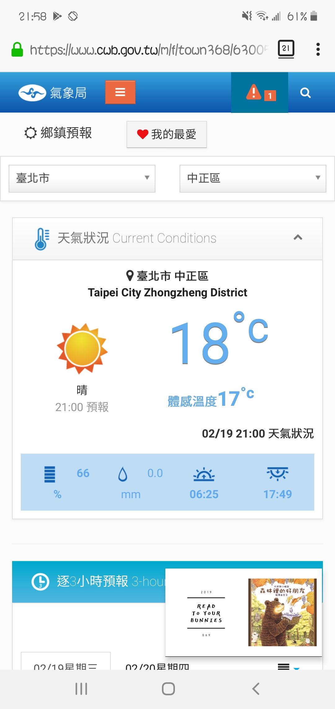
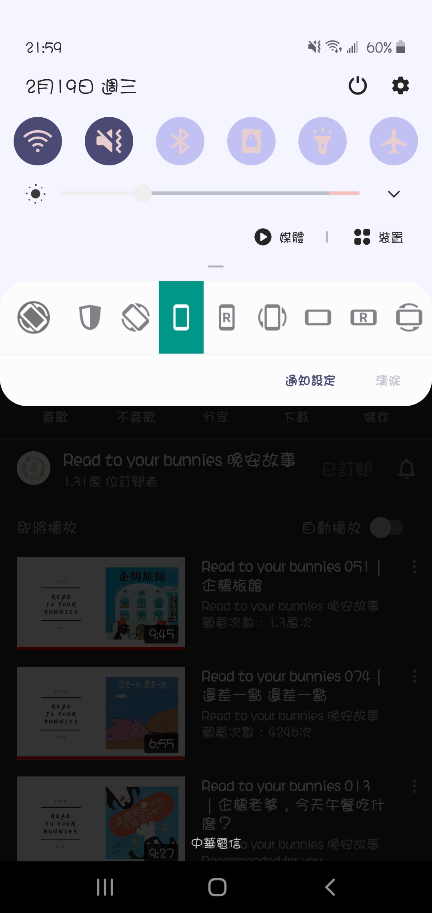
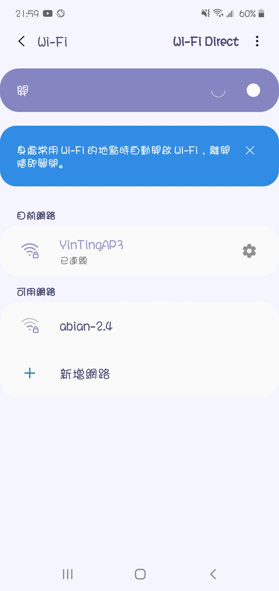
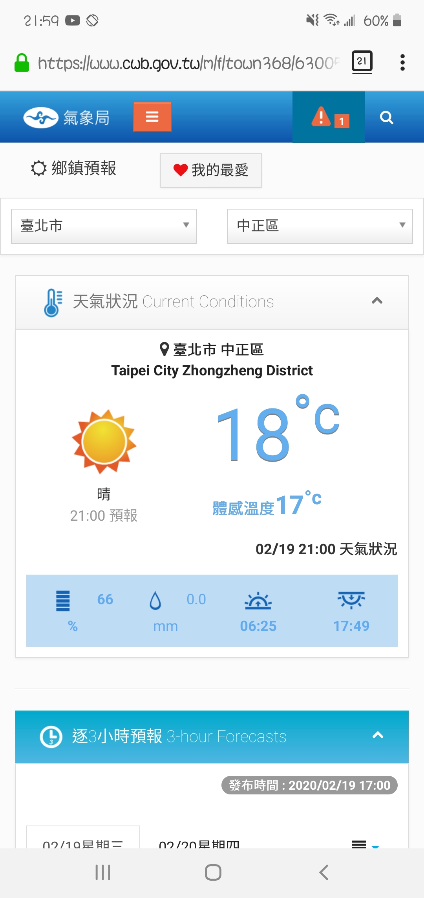

# 隱藏手機 (android) Youtube premium 背景播放時的小畫面

Youtube premium 允許使用者開背景播放，也可以關掉手機畫面繼續播放純聲音。只是在背景播放的時候，會在畫面上留有一個小畫面，像圖片右下角這樣子，Youtube 沒有提供關掉它的選項，不過我找到了一個可以關掉它的方法。

首先，先開啟 Youtube 的大畫面。

然後從螢幕上方拉出 android 的快捷工具列。

長按最左邊那顆 WiFi 按鈕、或是第二顆音效鈕 (藍芽那顆試過不行，其他的我還沒試)，手機會開啟全畫面的設定頁像這樣。

這時候你就可以隨意切換到首頁或再開啟你想用的其他 APP，Youtube 正常運作中，也可以看到左上角有長駐提示的 icon，但是那個小畫面就沒有出現了。

