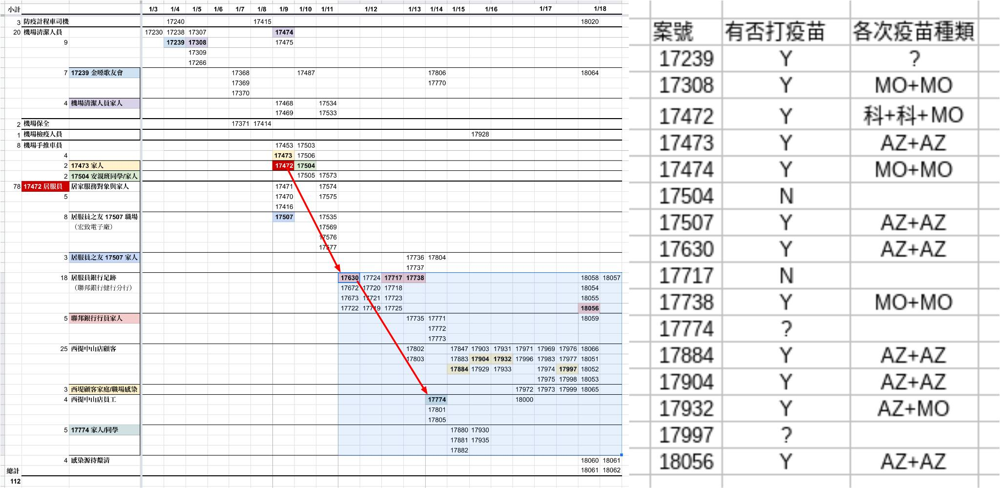

# 完整接種疫苗的傳染機會也不低

先別說先前的研究報告裡說，接種過疫苗的感染者，口鼻喉嚨的病毒量跟沒接種過的人一樣多，傳染力可能差不多。左邊這張最近這批傳染時序圖裡，標上顏色的格子是確定有傳染給別人的關鍵節點，16個人裡有12個打過疫苗，2個沒打過2個還查不到資料。雖然不能說疫苗對防傳染沒用，但絕對不是什麼感染傳染機會很低… 而且其他被感染者也是一大半都突破性感染。

柯文哲身為市長、又有醫師的權威，還在跟大家強調若符合疫苗標準，感染傳染機會很低(2022.1.17)，想了就令人生氣。我不完全反對政治人物說謊，但要是 for good，例如說如果能避免銀行擠兌，過一陣子大家都可以風平浪靜降低傷害就可能是好事可以一賭。但這邊如果大家相信柯文哲，就只是純粹把疫情鬧大。

(資料來源是 [武漢肺炎in臺灣相關整理](https://docs.google.com/spreadsheets/d/e/2PACX-1vRM7gTCUvuCqR3zdcLGccuGLv1s7dpDcQ-MeH_AZxnCXtW4iqVmEzUnDSKR7o8OiMLPMelEpxE7Pi4Q/pubhtml))
